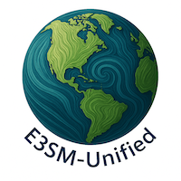

# E3SM-Unified



A metapackage for a unified
[conda environment](https://conda.io/projects/conda/en/latest/user-guide/tasks/manage-environments.html)
for analysis an other post-processing of results from Energy Exascale Earth
System Model (E3SM) simulations.

E3SM-Unified currently supports Linux and OSX, and python >=3.9,<3.11.
Support for Windows is not planned.

To create a new conda environment on a laptop or workstation (or on
HPC that is not already supported by the E3SM team), first install
[Miniforge3](https://github.com/conda-forge/miniforge#miniforge3).  Then,
create the E3SM-Unified environment (with MPI support from the `mpich` package
in this example), use:
```bash
conda create -n e3sm-unified -c conda-forge -c defaults -c e3sm \
    python=3.10 "e3sm-unified=*=mpi_mpich_*"
conda activate e3sm-unified
```
Each time you want to use the environment in the future, again run:
```bash
conda activate e3sm-unified
```

For the full list of packages in the current version of the metapackages, see:
https://github.com/E3SM-Project/e3sm-unified/blob/master/recipes/e3sm-unified/meta.yaml
